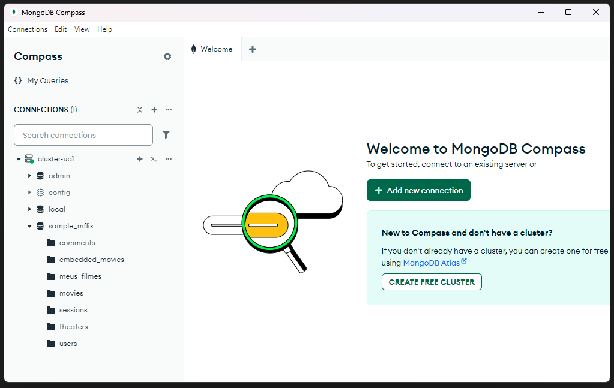
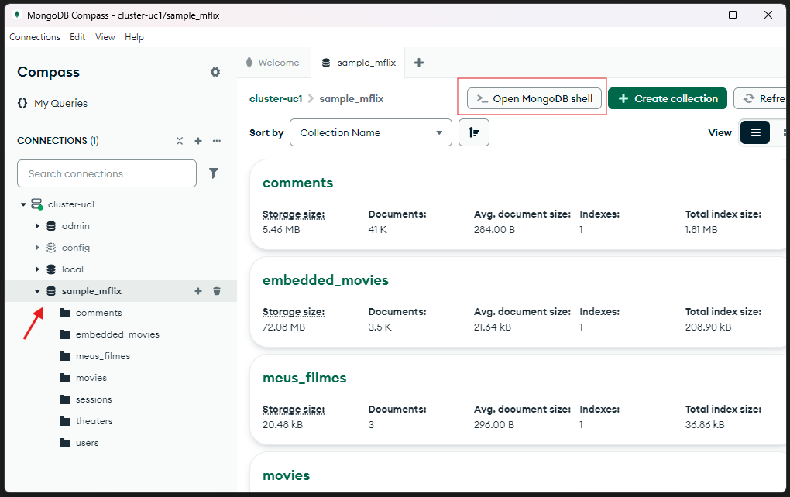
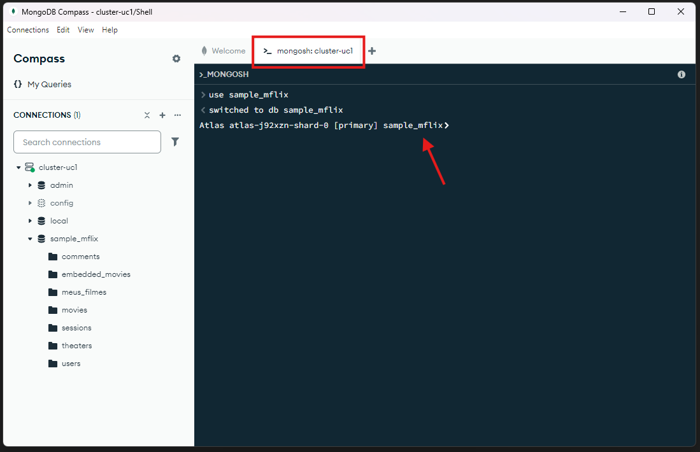

# Aula: Introdução à Modelagem de Dados no MongoDB Atlas

> ## Objetivo da Aula
> 
> Esta aula tem como objetivo introduzir os conceitos básicos de modelagem de dados em bancos NoSQL, especificamente no MongoDB. Será abordada a diferença entre bancos relacionais e NoSQL, estrutura de documentos JSON, princípios de modelagem no MongoDB e, por fim, um exemplo prático de modelagem para um sistema de biblioteca.
> 
> ---
>


## :five: Trabalhando com o Banco de Dados `sample_mflix`

O MongoDB disponibiliza uma base de dados pública chamada **`sample_mflix`**, contendo informações sobre filmes, diretores, elencos e comentários dos usuários.

### Coleções Disponíveis no `sample_mflix`:

| Coleção         | Descrição                             |
|------------------|----------------------------------------|
| `movies`         | Informações sobre filmes               |
| `comments`       | Comentários feitos por usuários        |
| `theaters`       | Informações sobre cinemas              |
| `users`          | Dados de usuários do sistema           |


> OBS: Para executar os comandos apresentados nos exemplos a seguir é necessário estar conectado ao Cluster criando no MongoDB Atlas na aula anterior. A conexão pode ser realizada via linha de comando utilizando o `mongodbsh`, ou utilizando a aplicação gráfica `MondoDB Compass`


{ width=75% style="display: block; margin: 0 auto"}

{ width=75% style="display: block; margin: 0 auto"}

{ width=75% style="display: block; margin: 0 auto"}

### 🧪 Exemplo 1: Consultar Filmes com Detalhes

A coleção `movies` possui documentos com informações completas sobre filmes.

**Exemplo de Documento:**

```json
{
  "_id": ObjectId("573a1390f6d9cbb1e75bdc52"),
  "title": "The Dark Knight",
  "year": 2008,
  "plot": "When the menace of the Joker wreaks havoc on the people of Gotham...",
  "genres": ["Action", "Crime", "Drama"],
  "runtime": 152,
  "cast": ["Christian Bale", "Heath Ledger", "Aaron Eckhart"],
  "directors": ["Christopher Nolan"],
  "imdb": {
    "rating": 9.0,
    "votes": 2460000
  },
  "tomatoes": {
    "viewer": { "rating": 9.2, "numReviews": 2500 }
  }
}
```

**Consulta Simples:**

```javascript
use sample_mflix
db.movies.find({ title: "The Dark Knight" }, { title: 1, year: 1, genres: 1 }).pretty()
```

**Saída:**

```js
{
  _id: ObjectId('573a13b5f29313caabd42722'),
  year: 2008,
  genres: [
    'Action',
    'Crime',
    'Drama'
  ],
  title: 'The Dark Knight'
}
```

### 🧪 Exemplo 2: Relacionamento entre Coleções (Filmes e Comentários)

A coleção `comments` tem uma referência ao filme através do campo `movie_id`.

**Estrutura do Documento na Coleção `comments`:**

```json
{
  "_id": ObjectId("..."),
  "name": "Maria Silva",
  "email": "maria@email.com",
  "text": "Adorei esse filme!",
  "movie_id": ObjectId("573a1390f6d9cbb1e75bdc52")
}
```

**Consultar Comentários de Um Filme:**

```javascript
// Primeiro, obter o _id do filme
var movie = db.movies.findOne({ title: "The Dark Knight" });

// Agora buscar todos os comentários desse filme
db.comments.find({ movie_id: movie._id }, { name: 1, text: 1, _id: 0 });
```

**Saída**

```js
{
  name: 'Andrea Le',
  text: 'Vitae repellat autem magni quo modi illum sapiente necessitatibus. Ullam molestiae dignissimos dignissimos maxime dolores maxime repudiandae. Vitae laboriosam aliquid eum.'
}
{
  name: 'Alliser Thorne',
  text: 'Ducimus possimus similique id cumque distinctio. Voluptates rerum ipsa dicta numquam ipsa qui eos. Ab ea modi in eaque. Maxime asperiores deleniti unde vitae qui.'
}
{
  name: 'Amy Ramirez',
  text: 'Commodi et voluptates incidunt. Optio reiciendis beatae ducimus accusantium perferendis veritatis. Iure numquam rerum voluptas omnis quasi vitae. Ab praesentium vero magni placeat totam placeat.'
}

... Continua ...

```


### 🧪 Exemplo 3: Usar Agregação para Contar Comentários por Filme

Podemos usar o estágio `$lookup` para fazer algo semelhante a um `JOIN` entre coleções.

```javascript
db.movies.aggregate([
  {
    $match: { title: "The Dark Knight" }
  },
  {
    $lookup: {
      from: "comments",
      localField: "_id",
      foreignField: "movie_id",
      as: "comentarios"
    }
  },
  {
    $project: {
      title: 1,
      comentarios_count: { $size: "$comentarios" },
      _id: 0
    }
  }
]);
```

**Explicação** 

- O método **aggregate()** permite encadear várias etapas (stages) que transformam os dados. Cada etapa é um objeto dentro de um array.

- **$match** – Filtrar documentos por título, age como um filtro inicial, semelhante ao WHERE em SQL. Isso reduz o número de documentos que passam para as próximas etapas — importante para performance.

- **$lookup** – Simular um JOIN entre coleções, realiza uma operação de junção entre duas coleções : movies e comments.

    - from : Coleção com a qual queremos fazer a junção → comments
    - localField: Campo na coleção atual ( movies ) usado para combinar → _id
    - foreignField: Campo na coleção comments que referencia o filme → movie_id
    - as: Nome do novo campo que será criado no documento com os resultados da junção → comentarios

- O resultado incluirá um novo campo chamado "comentarios" contendo todos os comentários relacionados ao filme "The Dark Knight".

- **$project** – Selecionar campos específicos no resultado - Define quais campos serão mostrados no resultado final.
    - title: 1 - Inclui o campo title no resultado
    - comentarios_count: { $size: "$comentarios" } - Cria um novo campo que conta quantos elementos há no array comentarios
    - _id: 0 - Exclui o campo _id do resultado

- O operador **$size** retorna o número de elementos em um array. 

**💡 Resultado esperado:**

```json
{
  "title": "The Dark Knight",
  "comentarios_count": 136
}
```

Este pipeline é muito útil quando você precisa juntar informações de diferentes coleções e mostrar apenas os dados mais relevantes , otimizando a leitura e facilitando a apresentação dos dados na sua aplicação.


### 📚 Exercício Proposto

#### Tarefa: Encontre os 5 filmes com melhor avaliação do IMDb

**Passos:**
1. Use a coleção `movies`.
2. Ordene pela nota `imdb.rating` em ordem decrescente.
3. Projete apenas título, ano e rating.
4. Limite a 5 resultados.

**Comando - Original:**

```javascript
db.movies.find(
  { "imdb.rating": { $exists: true } },
  { title: 1, year: 1, "imdb.rating": 1, _id: 0 }
)
  .sort({ "imdb.rating": -1 })
  .limit(5)
  .pretty();
```

**Comando - Corrigido:**

```js
db.movies.find(
  {
    "imdb.rating": {
      $exists: true,
      $ne: null,
      $ne: ""
    }
  },
  {
    title: 1,
    year: 1,
    "imdb.rating": 1,
    _id: 0
  }
)
  .sort({ "imdb.rating": -1 })
  .limit(5)
  .pretty();
```

**Explicação**

- Filtro (find)
    - $exists: garante que o campo esteja presente no documento.
    - $ne: significa not equal (diferente), então excluímos valores inválidos.
-  Projeção (projection)
    - Define quais campos serão mostrados (1 = incluir, 0 = excluir).
    - Excluímos _id para deixar o resultado mais limpo.
- Ordenação (sort)
    - `-1` significa ordenação decrescente , do maior para o menor rating.
- Limitação (limit)
    - Limita o resultado aos 5 primeiros filmes da lista.
- Formatação (pretty)
    - Melhora a legibilidade do resultado no terminal.

**💡 Dica Extra – Indexar para Performance**

Se você rodar essa consulta com frequência, pode melhorar a performance criando um índice:

```js
db.movies.createIndex({ "imdb.rating": -1 });
```

Isso acelera a ordenação e filtros baseados na nota do IMDb.

